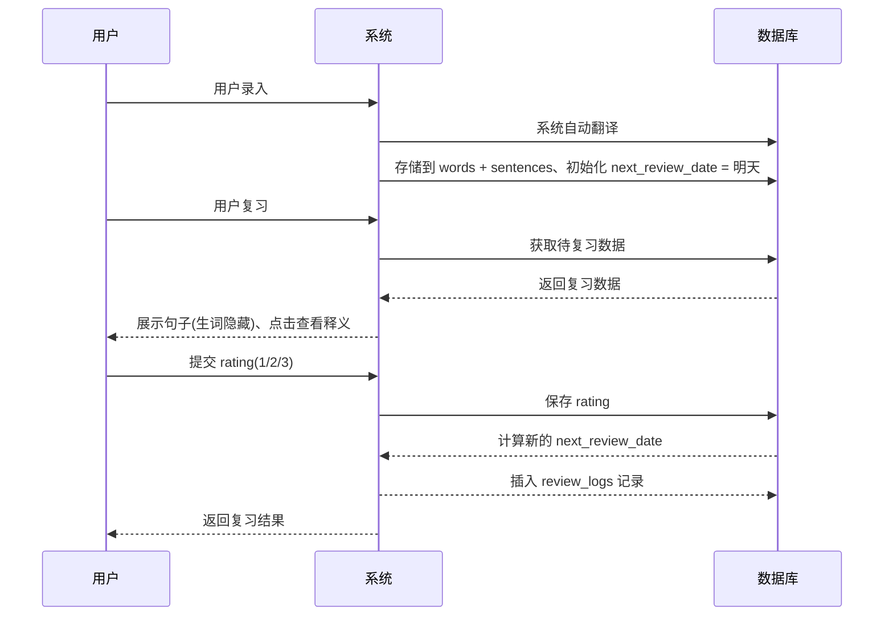
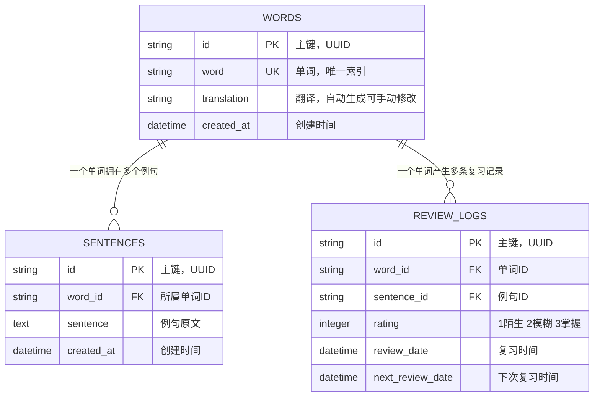
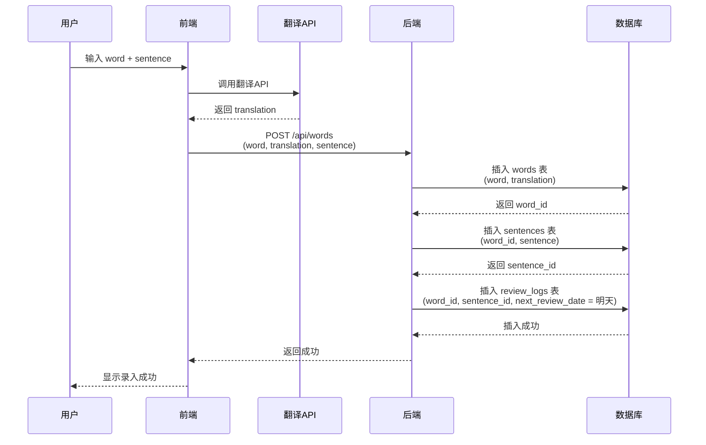
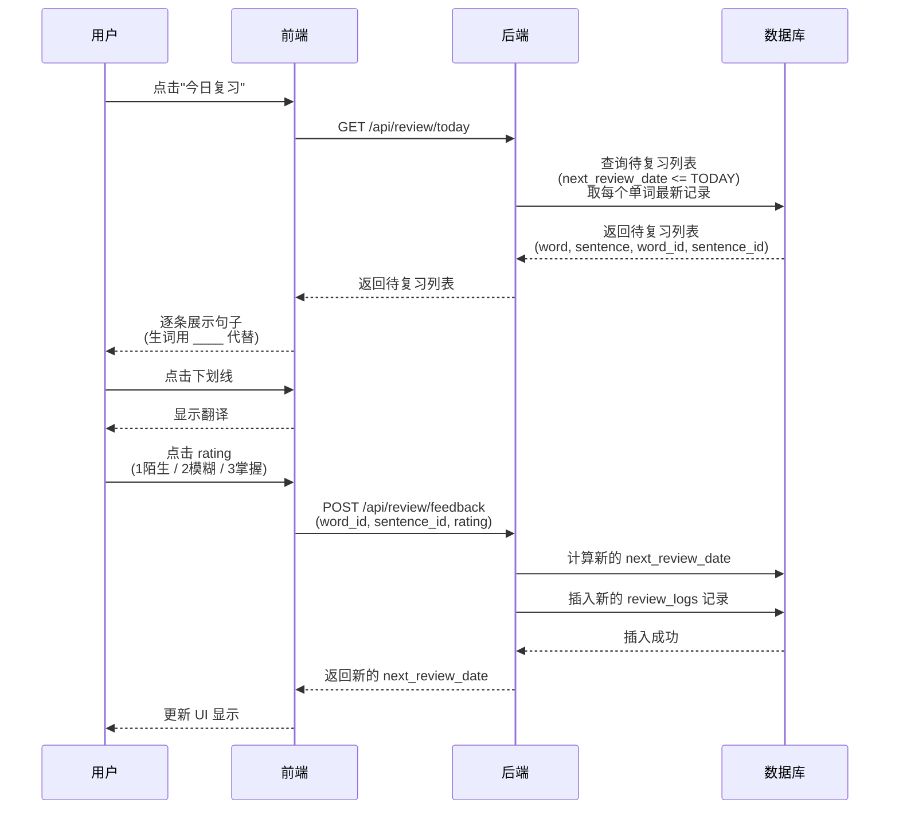

# 数据库设计文档 v0.1

> 文档版本：v0.1 | 最后更新：2026-06-21 | 数据库类型：SQLite（v0.1)

## 1. 核心设计理念

### 1.1 三大原则

| 原则 | 说明 |
| :--- | :--- |
| **单词与例句分离** | `words` 表只存单词本身，例句独立存于 `sentences` 表，一个单词可对应多个例句 |
| **语境驱动复习** | 复习时展示的是“句子”，而不是“单词卡片”，生词默认隐藏，逼用户靠语境猜词义 |
| **日志记录一切** | `review_logs` 表记录每次复习的反馈（rating + 时间），用于计算下一次复习时间 |

### 1.2 核心业务流



## 2. ER 关系图



**关系解读**：

- `WORDS ||--o{ SENTENCES : has`：一个单词可以拥有 **0 个到多个** 例句
- `WORDS ||--o{ REVIEW_LOGS : generates`：一个单词可以产生 **0 条到多条** 复习日志
- `PK`：主键-唯一标识记录数据
- `UK`: 唯一键-确保字段不重复
- `FK`: 外键-可重复应用其他表

## 3. 字段详细说明

### 3.1 Words（单词主表）

| 字段名 | 类型 | 约束 | 业务说明 |
| :--- | :--- | :--- | :--- |
| `id` | TEXT | PRIMARY KEY | 使用 UUID 生成（如 `7f8e9a0b-...`），不依赖自增 ID |
| `word` | TEXT | NOT NULL, UNIQUE | 用户录入的单词，**查重时统一转小写**（如 `Apple` 和 `apple` 视为重复） |
| `translation` | TEXT | | **v0.1 由系统自动生成**（调用翻译 API），用户可手动修改 |
| `created_at` | DATETIME | DEFAULT CURRENT_TIMESTAMP | 首次录入时间 |

**索引**：

```sql
CREATE INDEX idx_word ON words(word);
```

**业务规则**：

- 用户录入时，系统自动调用翻译 API 填充 `translation`；
- 若 API 调用失败，允许 `translation` 为空，但保存按钮不可用（需用户手动补填）。

### 3.2 Sentences（例句库）

| 字段名 | 类型 | 约束 | 业务说明 |
| :--- | :--- | :--- | :--- |
| `id` | TEXT | PRIMARY KEY | UUID |
| `word_id` | TEXT | NOT NULL, FOREIGN KEY | 关联 `words.id`，**级联删除**（单词删除时，其所有例句一并删除） |
| `sentence` | TEXT | NOT NULL | 用户粘贴或输入的原句（长度不限，用 TEXT 类型） |
| `source` | TEXT | | 记录来源（如“《经济学人》2026-06-21”），选填 |
| `created_at` | DATETIME | DEFAULT CURRENT_TIMESTAMP | 录入时间 |

**索引**：

```sql
CREATE INDEX idx_word_id ON sentences(word_id);
```

**业务规则**：

- 一个单词可对应 **0 个到多个** 例句（v0.1 强制至少 1 个）；
- 复习时，系统从该单词的例句库中**随机选一条**展示。

### 3.3 Review_Logs（复习日志）

| 字段名 | 类型 | 约束 | 业务说明 |
| :--- | :--- | :--- | :--- |
| `id` | TEXT | PRIMARY KEY | UUID |
| `word_id` | TEXT | NOT NULL, FOREIGN KEY | 关联 `words.id` |
| `sentence_id` | TEXT | NOT NULL, FOREIGN KEY | **关键**：记录这次复习用的是哪条例句，便于追溯“这句话我复习过几次” |
| `rating` | INTEGER | NOT NULL, CHECK(rating IN (1,2,3)) | 用户反馈：`1`=陌生，`2`=模糊，`3`=掌握 |
| `review_date` | DATETIME | NOT NULL, DEFAULT CURRENT_TIMESTAMP | 本次复习的发生时间 |
| `next_review_date` | DATETIME | NOT NULL | 根据 rating 计算出的下次复习日期（如 `2026-06-24`） |

**索引**：

```sql
-- 核心查询：今日待复习列表
CREATE INDEX idx_next_review ON review_logs(next_review_date);

-- 加速查询某单词的复习历史
CREATE INDEX idx_word_review ON review_logs(word_id, review_date);
```

**业务规则**：

- 每次复习产生 **一条新记录**（不更新旧记录，保留完整历史）；
- 查询“今日待复习”时，取每个单词 **最新一条** `review_logs` 记录的 `next_review_date`。

## 4. v0.1 核心数据流

### 4.1 录入流程



### 4.2 复习流程



## 5. 间隔算法

| 用户点击 | `rating` | 计算规则 | 示例（今天 2026-06-21） |
| :--- | :--- | :--- | :--- |
| 陌生 | 1 | `next_review_date = 明天` | 2026-06-22 |
| 模糊 | 2 | `next_review_date = 3 天后` | 2026-06-24 |
| 掌握 | 3 | `next_review_date = 7 天后` | 2026-06-28 |

**计算公式**：

```python
# 伪代码
if rating == 1:
    next_review_date = date('now', '+1 day')
elif rating == 2:
    next_review_date = date('now', '+3 days')
elif rating == 3:
    next_review_date = date('now', '+7 days')
```

> **v0.2 优化方向**：引入 **FSRS 算法**，根据历史正确率动态调整间隔天数，而非固定值。

## 6. 翻译自动生成API

- **有道智云翻译 API（免费版）** 每月 100 万字符免费额度，接入简单

## 7. 性能优化待升级

| 优化项 | 说明 | 触发时机 |
| :--- | :--- | :--- |
| **冗余 `latest_next_review_date` 字段** | 在 `words` 表中增加冗余字段，避免每次查询都要 `MAX(id) GROUP BY`，提升列表查询性能 | 当 `review_logs` 表超过 1 万条时 |
| **读写分离** | 查询走从库，写入走主库 | 当用户量超过 100 人时 |
| **分页查询** | 今日复习列表超过 20 条时，支持分页加载 | 用户录入超过 200 个单词时 |

## 8. 数据库待升级

| 版本 | 数据库 | 说明 |
| :--- | :--- | :--- |
| v0.1（开发阶段） | **SQLite**（本地文件） | 无需安装数据库，数据存于本地 `glint.db` 文件，适合单机开发 |
| v1.0（正式上线） | **PostgreSQL**（云数据库） | 迁移数据 + 支持多用户（用户表 + 关联） |
